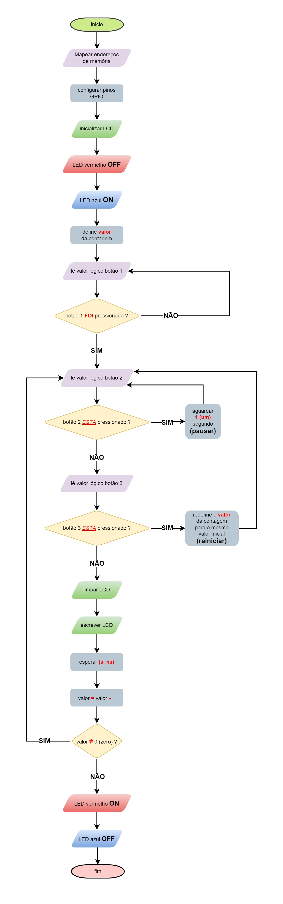

# Problema #1 – 2023.1 Linguagem Assembly

## Demonstração

https://user-images.githubusercontent.com/7541966/232961840-0185417e-be34-4628-bf4e-922c55182c90.mp4

## Fluxograma

referencia: https://app.diagrams.net/ (software utilizado para criar o fluxograma)

## Tópicos

:small_blue_diamond: [Descrição do Projeto](#descrição-do-projeto-e-requisitos)

:small_blue_diamond: [Ambiente de Desenvolvimento](#ambiente-de-desenvolvimento)

:small_blue_diamond: [Ambiente de Execução](#instalação-configuração-de-ambiente-e-execução)

:small_blue_diamond: [Funcionamento](#funcionamento)

:small_blue_diamond: [Testes e Resultados](#testes-e-resultados)

:small_blue_diamond: [Desenvolvedores](#desenvolvedores)

## Conteúdo

:heavy_check_mark: Códigos detalhadamente comentados;

:heavy_check_mark: Script de compilação tipo Makefile para geração do código executável;

:heavy_check_mark: Detalhamento dos software usados no trabalho, incluindo softwares básicos;

:heavy_check_mark: Arquitetura do computador usado nos testes.

## Descrição do Projeto e Requisitos

Este projeto consiste em uma solução desenvolvida em Assembly para a Orange Pi PC Plus.

O objetivo é desenvolver um aplicativo de temporização (timer) que apresente a contagem num display LCD 16x2. O tempo inicial deverá ser configurado diretamente no código. Além disso, deverão ser usados 2 botões de controle: 1 para iniciar/parar a contagem e outro para reiniciar a partir do tempo definido.

Com o objetivo de desenvolver uma biblioteca para uso futuro em conjunto com um programa em linguagem C, a função para enviar mensagem para o display deve estar separada como uma biblioteca (.o), e permitir no mínimo as seguinte operações: Limpar display; Escrever caractere; Posicionar cursor (linha e coluna).

O código deve ser escrito em Assembly, permitindo configurar o tempo de contagem e usando botões para controlar início/parada e reinício do temporizador.

## Ambiente de desenvolvimento

### Softwares utilizados para desenvolvimento e testes

A solução foi desenvolvida utilizando de editores de texto. Seja direto na placa ou o disponibilizado pelo próprio sistema operacional.

### Arquitetura do computador

Os computadores utilizados para desenvolvimento e testes foram os presentes no LEDS.

## Instalação, configuração de ambiente e execução

<>

## Execução e Testes

Para testar o sistema, basta compilar o código e executá-lo na Orange Pi. É possível usar um osciloscópio ou multímetro para verificar o funcionamento correto dos botões e da contagem de tempo.

## Funcionamento

O funcionamento do sistema consiste em: o usuário inicia a contagem pressionando o botão. Durante a contagem, o usuário pode pausar ou reiniciar o temporizador pressionando os botões correspondentes.

### Arquitetura

O sistema foi desenvolvido para a Orange Pi PC Plus, utilizando a arquitetura ARM v7. Para compilar o código, é necessário usar o utilitário Makefile, que está incluído no projeto.

### Arquitetura ARM
ARM significa Advanced RISC Machines, ou Máquinas RISC Avançadas. RISC é acrônimo de Reduced Instruction Set Computer, ou Computador com um conjunto reduzido de instruções. O que mostra que a arquitetura ARM foi inspirado no RISC, onde o objetivo era desenvolver um hardware simples e também um conjunto pequeno de instruções que garanta tamanho reduzido, velocidade e eficiência no consumo de potência.

### Processador ARM

	 

    No projeto foi utilizado o processador Allwinner H3 Quad-core Cortex-A7
    de 1.5 GHz. Algumas características básicas são:	    
    - Representação em 32 bits
    - 16 registradores:
           - r0 até r12: são de uso geral
           - r13: Stack Pointer (SP)
           - r14: Link Register (LR)
           - r15: Program Counter (PC)	

### Orange Pi PC Plus

	
	Orange Pi PC Plus é um SBC Single-Board Card computer, ou, computador de cartão de placa única.	Tem código aberto e usa arquitetura ARM. Pode executar Ubuntu e outros sistemas operacionais. Orange Pi PC Plus usa Allwinner H3 como CPU. A Orange Pi PC Plus pode ser usada para construir um servidor de rede sem fio, jogos, Reprodutor de música e video, entre outros fins. Ela foi projetada para quem deseja usar a tecnologia para criar e inovar.

    

### GPIO

	
	
GPIO significa General-Purpose Input/Output, ou, Entrada e Saída de Uso Geral. Uma interface de E/S em placas de circuito.

	
GPIO é diferente dos padrões de porta comuns (como VGA, HDMI, VDI ou USB). Es esses cabos, cada pino conectado dentro da conexão tem uma finalidade definida, que é determinada pelo órgão regulador que criou o padrão.

	
A interface GPIO refere-se a um conjunto de pinos. Eles não possui uma função específica, por isso que são chamados de uso geral. Os pino GPIO podem enviar ou receber sinais elétricos que são determinados pelo projetista.

	
Embora a maioria dos pinos de uma porta ou interface tenha uma finalidade específica, como enviar um sinal para um determinado componente, a função de um pino GPIO é personalizável e pode ser controlada por software. O GPIO coloca você no comando do que cada pino realmente faz. Existam diferentes tipos de pinos na matriz GPIO.

*   Pinos de finalidade especial, que variam de acordo com o GPIO específico em questão.
*   Pinos GPIO, que podem ser configurados para enviar ou receber sinais elétricos.
*   Pinos de aterramento que não fornecem energia, mas são necessários para completar alguns circuitos.
*   Pinos que fornecem energia em tensões típicas, como 3,3 V ou 5 V (para alimentar dispositivos conectados que não possuem fonte de alimentação própria, como um simples LED.

GPIO São usados por circuitos de sistema em chip (SOC), que incluem um processador, memória e interfaces externas em um único chip. Os pinos GPIO permitem que esses chips sejam configurados para diferentes finalidades e funcionem com diversos tipos de componentes.

As interfaces GPIO são geralmente usadas em conjunto com uma placa de prototipação (Protoboard). Protoboards são um tipo de placa de circuito temporária. Você pode prototipar circuitos adicionando, removendo ou movendo componentes eletrônicos. Muitos projetos que envolvem dispositivos como um Orange Pi fazem com que você monte seu dispositivo em uma placa de ensaio e, em seguida, conecte-o aos pinos GPIO usando fios.

Um dispositivo popular que faz uso de pinos GPIO é o Orange Pi. Esses pinos atuam como interruptores que produzem 3,3 volts quando definidos como ALTO e sem tensão quando definidos como BAIXO. Você pode conectar um dispositivo a pinos GPIO específicos e controlá-lo com um programa de software. Por exemplo, você pode conectar um LED a um GPIO e um pino de aterramento em um Orange Pi. Se um programa de software disser ao pino GPIO para ligar, o LED acenderá.

### Diagrama de Pinagem do Orange Pi PC Plus v1.2

<!-- 	 -->
	

### Visão Geral do Protótipo

	
	
Utilizamos uma placa de prototipação (protoboard) para reunir todos os componentes eletrônicos do projeto. A Orange PI e sua porta GPIO é conectada usando uma Placa de Extenção que pode ser vista em destaque na imagem acima. Esta placa de Extenção é de uma Raspberry PI, no entanto, sua interface tem a mesma quantidade de pinos da Orange Pi. Por isso, vamos desconsiderar os nomes inscritos originalmente na Placa de Extenção e vamos adotar a nomenclatura oficial do Diagrama de Pinagem da Orange Pi.

### Mapeamento dos pinos GPIO

	
	
Esta seção apresenta o mapeamento dos pinos GPIO com as conexões do display (LCD 16x2), botões (push buttons) e LEDs (Vermelho e Azul) utilizados no projeto. O mapeamento é essencial para garantir a correta comunicação entre o Orange PI e os demais componentes, possibilitando funcionamento das interfaces de usuário.

### Interface com o Display LCD 16x2

	
	
O mapeamento entre a GPIO e o display LCD 16x2 no modo 4 bits é feito por meio da conexão de 7 pinos da porta GPIO da Orange Pi com outros 7 pinos do microcontrolador display (LCD 16x2). Esses 7 pinos são divididos em 4 bits de dados e 3 bits de controle.

	
Os 4 bits de dados (DB4 a DB7) são responsáveis por enviar as informações que serão exibidas no display. Já os 3 bits de controle (RS, Enable e RW) são responsáveis por indicar ao display qual informação está sendo enviada (dados ou instruções), quando uma nova informação deve ser lida (sinal de enable) e se a operação será de escrita ou leitura (neste caso, o bit RW é configurado como leitura ou escrita).Neste contexto, o bit referente ao RW é sempre setado como escrita.

	
Para o mapeamento, são utilizados os pinos GPIO do microcontrolador, que são configurados como saídas e conectados aos pinos correspondentes no display.

### Assembly

    

        É uma linguagem de programação composta por mnemônicos simples. Ela usa as instruções da arquitetura (ou processador) que estiver sendo usado.
    

### Lista das instruções utilizadas no projeto   
    
    
    - ADD                   - CMP                   - SVC                   - AND                   - ORR
    - MOV                   - B                     - PUSH                  - LSL                   - BEQ
    - LDR                   - BL                    - POP                   - LSR                   - BLT
    - STR                   - BGT                   - SUB                   - BIC                   - BX
    

### Descrição das instruções

### ADD

ADD é uma instrução que executa a soma de valores que estão em registradores ou denifidos de forma imediata. A sintaxe é:

    ADD Rdestino, Rtermo1, Rtermo2
    ou
    ADD Rdestino, Rtermo1, #valorImediato

Onde, Rdestino é o registrador de destino. Rtermo1 é o registrador que contém o primeiro operando. Rtermo2 é um segundo operando e #valorImediato é qualquer valor no intervalo 0-4095.

### MOV

A instrução MOV copia o valor de Operand2 em Rd. A sintaxe é:

    MOV Rd, Operand2
    ou
    MOV Rd, #valorImediato
    
Onde, Rd é o registrador de destino. Operand2 é um segundo operando e #valorImediato é qualquer valor no intervalo 0-65535.

### LDR

A instrução LDR carrega um registrador com um valor da memória. A sintaxe é:

    LDR Rd, [Rn, Rm]
    
Onde, Rd especifica o registro a ser carregado. Rn especifica o registro no qual o endereço de memória é baseado. Rm especifica o registro que contém um valor a ser usado como deslocamento

### STR

A instrução STR armazenam um valor de registro na memória. A sintaxe é:

    LDR Rd, [Rn, Rm]
    
Onde, Rd especifica o registro a ser armazenado. Rn especifica o registro no qual o endereço de memória é baseado. Rm especifica o registro que contém um valor a ser usado como deslocamento

### CMP

A instrução CMP comparam o valor em um registrador. A sintaxe é:
    
    CMP{cond} Rn, Operand2
    ou
    CMP{cond} Rn, #valorImediato

Onde, cond é um código de condição opcional. Rn é o registrador ARM contendo o primeiro operando. Operand2 é um segundo registrador. #valorImediato é qualquer valor no intervalo 0-255.

### B

A instrução B causa um desvio incondicional para o rótulo criado. A sintaxe é:

     B label
     
Onde, label é um rótulo criado para marcar onde o programa continuará a execução depois do desvio.

### BL

A instrução BL faz com que um desvio incondicional seja rotulado e copia o endereço da próxima instrução em LR (R14, o registrador de link). A sintaxe é:

     BL label
     
Onde, label é um rótulo criado para marcar onde o programa continuará a execução depois do desvio.

### BGT

A instrução BGT causa um desvio condicional para o rótulo criado. A sintaxe é:

     B{cond} label
     
Onde, label é um rótulo criado para marcar onde o programa continuará a execução depois do desvio. GT (greater than) significa maior que. Desvia se o vaor do primeiro registrador for maior do que o valor do segundo registrador.

### svc

A instrução SVC (Supervisor Call) é uma instrução usada em sistemas operacionais para fazer chamadas do sistema. A sintaxe é:

    SVC #valorImediato

Onde, #valorImediato é um valor imediato que identifica o serviço do sistema a ser chamado. A instrução SVC interrompe a execução do programa e transfere o controle para o sistema operacional, que então lida com a chamada do sistema

### pop

A instrução POP é usada para retirar valores da pilha. A sintaxe é:

    POP {RlistaReg}

Onde, RlistaReg é uma lista separada por vírgulas de registradores a serem retirados da pilha. A instrução POP é útil para restaurar o estado dos registradores após um salvamento de estado usando a instrução PUSH.

### push

A instrução PUSH é usada para colocar valores na pilha. A sintaxe é:

    PUSH {RlistaReg}

Onde, RlistaReg é uma lista separada por vírgulas de registradores a serem colocados na pilha. A instrução PUSH é útil para salvar o estado dos registradores antes de fazer uma chamada do sistema ou uma operação que possa modificar o estado dos registradores

### SUB

SUB é uma instrução que executa a subtração de valores que estão em registradores ou denifidos de forma imediata. A sintaxe é:

    SUB Rdestino, Rtermo1, Rtermo2

Onde, Rdestino é o registrador de destino. Rtermo1 é o registrador que contém o primeiro operando e Rtermo2 é um segundo operando.

A instrução SUB subtrai o valor do registrador Rtermo2 ou o valor imediato do valor no registrador Rtermo1 e armazena o resultado no registrador de destino Rdestino. O resultado pode ser positivo, negativo ou zero. Caso o resultado seja negativo, a flag N (negativo) é ativada. Caso o resultado seja zero, a flag Z (zero) é ativada.

### AND

AND é uma instrução lógica que faz a operação AND bit a bit entre dois registradores e armazena o resultado em um registrador de destino. A sintaxe é:

    AND Rdestino, Rtermo1, Rtermo2

Onde, Rdestino é o registrador de destino. Rtermo1 e Rtermo2 são os registradores que contém os operandos para a operação AND.

A instrução AND executa uma operação AND bit a bit entre os valores dos registradores Rtermo1 e Rtermo2 e armazena o resultado no registrador de destino Rdestino. O resultado final contém um bit '1' em cada posição em que ambos os operandos tenham um bit '1'.

### LSL

LSL é uma instrução de deslocamento lógico à esquerda (Logical Shift Left) que desloca os bits de um valor de um registrador em uma determinada quantidade de posições para a esquerda. A sintaxe é:

    LSL Rdestino, Rfonte, #quantidade

Onde, Rdestino é o registrador de destino. Rfonte é o registrador que contém o valor a ser deslocado. #quantidade é a quantidade de posições que o valor deve ser deslocado.

A instrução LSL desloca o valor do registrador Rfonte em #quantidade de posições para a esquerda e armazena o resultado no registrador de destino Rdestino. Os bits que saem pela esquerda são perdidos, e os bits que entram na direita são preenchidos com zeros.

### LSR

LSR é uma instrução de deslocamento lógico à direita (Logical Shift Right) que desloca os bits de um valor de um registrador em uma determinada quantidade de posições para a direita. A sintaxe é:

    LSR Rdestino, Rfonte, #quantidade

Onde, Rdestino é o registrador de destino. Rfonte é o registrador que contém o valor a ser deslocado. #quantidade é a quantidade de posições que o valor deve ser deslocado.

A instrução LSR desloca o valor do registrador Rfonte em #quantidade de posições para a direita e armazena o resultado no registrador de destino Rdestino. Os bits que saem pela direita são perdidos, e os bits que entram pela esquerda são preenchidos com zeros.

### BIC

BIC é uma instrução lógica que executa uma operação bit a bit de "bit clear" (limpar bit). Ela limpa os bits de um registrador que correspondem a um segundo registrador (que age como máscara), armazenando o resultado em um terceiro registrador. A sintaxe é:

    BIC Rdestino, Rfonte, Rmascara

Onde, Rdestino é o registrador de destino. Rfonte é o registrador que contém o valor a ser limpo. Rmascara é o registrador que contém a máscara.

A instrução BIC executa uma operação bit a bit de "bit clear" entre os valores dos registradores Rfonte e Rmascara e armazena o resultado no registrador de destino Rdestino. Os bits no Rdestino são os mesmos que no Rfont

### ORR

ORR é uma instrução lógica que executa uma operação bit a bit de "bitwise OR" (ou bit a bit) entre dois registradores e armazena o resultado em um terceiro registrador. A sintaxe é:

    ORR Rdestino, Rtermo1, Rtermo2

Onde, Rdestino é o registrador de destino. Rtermo1 e Rtermo2 são os registradores que contém os operandos para a operação OR.

A instrução ORR executa uma operação bit a bit de "bitwise OR" entre os valores dos registradores Rtermo1 e Rtermo2 e armazena o resultado no registrador de destino Rdestino. O resultado final contém um bit '1' em cada posição em que pelo menos um dos operandos tenha um bit '1'.

### BEQ

BEQ é uma instrução de salto condicional (branch equal) que salta para um endereço de memória especificado se a última comparação (normalmente com a instrução CMP) indicar que dois valores são iguais. A sintaxe é:

    BEQ label

Onde, label é o rótulo da instrução para a qual o salto deve ser feito se a comparação for verdadeira.

A instrução BEQ salta para a instrução rotulada pelo label somente se a última comparação (normalmente com a instrução CMP) indicar que dois valores são iguais. Caso contrário, a execução continua com a próxima instrução após a instrução BEQ.

### BLT

BLT é uma instrução de salto condicional (branch less than) que salta para um endereço de memória especificado se a última comparação (normalmente com a instrução CMP) indicar que o primeiro valor é menor que o segundo. A sintaxe é:

    BLT label

Onde, label é o rótulo da instrução para a qual o salto deve ser feito se a comparação for verdadeira.

A instrução BLT salta para a instrução rotulada pelo label somente se a última comparação (normalmente com a instrução CMP) indicar que o primeiro valor é menor que o segundo. Caso contrário, a execução continua com a próxima instrução após a instrução BLT.

### BX

BX é uma instrução de salto que alterna o processador para executar código em um endereço de memória especificado. A sintaxe é:

    BX Rfonte

Onde, Rfonte é o registrador que contém o endereço de memória para o qual o processador deve saltar.

A instrução BX alterna o processador para executar código em um endereço de memória especificado pelo valor do registrador Rfonte. Isso é útil para implementar saltos para funções em código de assembly.

### Mapeamento de Pinos

Esta seção apresenta o mapeamento dos pinos de entrada/saída (GPIO) com as conexões do display utilizado no projeto. O mapeamento é essencial para garantir a correta comunicação entre o microcontrolador da GPIO e o display, possibilitando o correto funcionamento da interface de usuário.

#### Mapeamento dos Pinos da GPIO para o DISPLAY

O mapeamento entre a GPIO e o display LCD 16x2 no modo 4 bits é feito por meio da conexão de 7 pinos do microcontrolador com 7 pinos do display. Esses 7 pinos são divididos em 4 bits de dados e 3 bits de controle.

Os 4 bits de dados (D4 a D7) são responsáveis por enviar as informações que serão exibidas no display. Já os 3 bits de controle (RS, E e RW) são responsáveis por indicar ao display qual informação está sendo enviada (dados ou instruções), quando uma nova informação deve ser lida (sinal de enable) e se a operação será de escrita ou leitura (neste caso, o bit RW é configurado como leitura ou escrita).Neste contexto, o bit referente ao RW é sempre setado como escrita.

Para o mapeamento, são utilizados os pinos GPIO do microcontrolador, que são configurados como saídas e conectados aos pinos correspondentes no display.

O mapeamento apresentado na tabela abaixo é realizado por meio da identificação dos pinos do microcontrolador que serão utilizados e a correspondência com os pinos do display.

        | GPIO | DISPLAY |
        |------|---------|
        | 40   | D7      |
        | 38   | D6      |
        | 36   | D5      |
        | 32   | D4      |
        | 28   | E       |
        | 22   | RS      |
        | 20   | GND(RW) |

Os pinos do microcontrolador estão conectados aos pinos correspondentes do display para que seja possível exibir as informações corretamente.

## Testes e Resultados

<>

## Desenvolvedores

| [ Gabriel Carvalho](https://github.com/GabCarvaS) | [ Vinicius Vieira](https://github.com/vini-insight) | [ Everton Bruno Silva dos Santos](https://github.com/evertonbrunosds) |
| :---------------------------------------------------------------------------------------------------------------------------------------: | :----------------------------------------------------------------------------------------------------------------------------------------: | :-----------------------------------------------------------------------------------------------------------------------------------------------------------: |

# Assembly1
Assembly1

Produto
códigos detalhadamente comentados;
Script de compilação tipo Makefile para geração do código executável;
Detalhamento dos software usados no trabalho, incluindo softwares básicos;
Arquitetura do computador usado nos testes;

## PBL

Descrição de instalação, configuração de ambiente e execução;
Descrição dos testes de funcionamento do sistema, bem como, análise dos resultados alcançados.

Documentação:
Documentação técnica considerando qualidade da redação (ortografia e gramática), organização dos tópicos, definição do problema, descrição da solução, explicação dos experimentos, análise dos resultados, detalhando os itens não atendidos, se for o caso.
